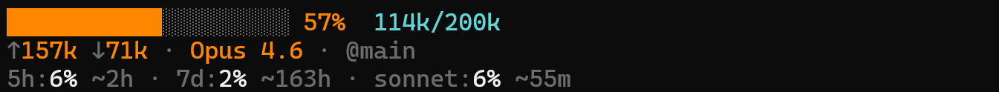

# chonker

Claude Code says 200K tokens but the real usable limit is somewhere around 70-120K. There's no built-in way to see how full your context is. You just keep working until Claude starts forgetting things.

## What it looks like



## Install

```
claude --plugin-dir /path/to/chonker
```

## How it works

On first session start, it auto-configures `~/.claude/settings.json` to run a meter script. Claude Code pipes token usage and model info as JSON to the script every 5 seconds and it outputs a formatted one-liner. The plugin configures itself.
