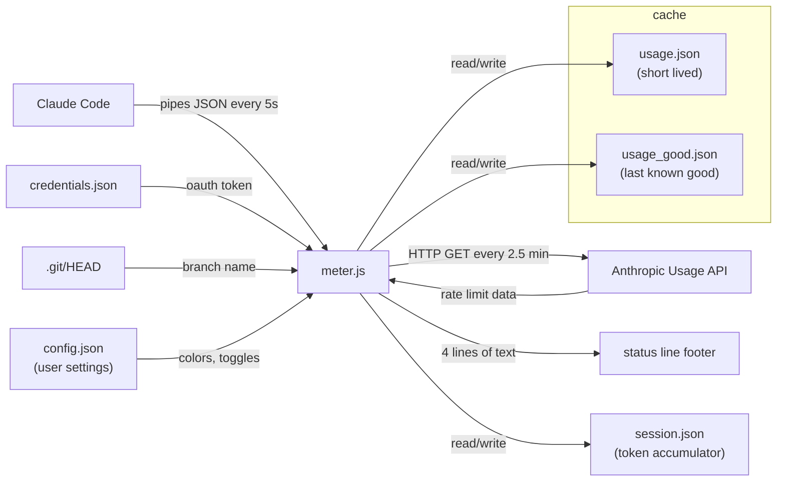

# chonker

Claude Code says 200K tokens but the real usable limit is somewhere around 70-120K. There's no built-in way to see how full your context is. You just keep working until Claude starts forgetting things.

## What it shows

- Context window usage bar with percentage and token ratio
- Input and output tokens with model name
- Real time rate limit utilization (5 hour session, 7 day weekly, model specific, extra usage)
- Current git branch
- Burn rate: how fast you are consuming your 5h rate limit (`0.0%/min` when idle, lights up when you are actively burning)

## What it looks like


## Install

### npm (recommended)

```
npm install -g @adikuma/chonker
chonker
```

Restart Claude Code to see the meter.

### Dev

```
claude --plugin-dir /path/to/chonker
```

## How it works

On first session start, it auto-configures `~/.claude/settings.json` to run a meter script. Claude Code pipes token usage and model info as JSON to the script every 5 seconds and it outputs a formatted status line. Rate limit data is fetched from the Anthropic API and cached locally so it stays fast.

## Architecture


```mermaid
flowchart LR
    CC[Claude Code] -->|pipes JSON every 5s| M[meter.js]
    CR[credentials.json] -->|oauth token| M
    GIT[.git/HEAD] -->|branch name| M
    M -->|HTTP GET every 2.5 min| API[Anthropic Usage API]
    API -->|rate limit data| M
    M -->|4 lines of text| SL[status line footer]

    subgraph cache
        UC["usage.json<br/>(short lived)"]
        UG["usage_good.json<br/>(last known good)"]
    end

    M -->|read/write| UC
    M -->|read/write| UG
    M -->|read/write| SS["session.json<br/>(token accumulator)"]
    CF["config.json<br/>(user settings)"] -->|colors, toggles| M
```

**Line 1** (progress bar, token count) and **Line 2** (input/output tokens, model, branch) update every 5 seconds. This data comes straight from Claude Code through the pipe so it is always real time.

**Line 3** (rate limits) comes from the Anthropic usage API. This is a network call so it is cached to keep things fast and avoid getting rate limited by the endpoint itself.

**Line 4** (burn rate) tracks how fast your 5h rate limit is being consumed. It compares successive API snapshots every 2.5 minutes and computes `%/min`. Shows `0.0%/min` dimmed when usage is flat, and lights up in teal when you are actively burning. Appears after the first two API cycles (~5 min after start).

## Caching

The rate limit numbers on line 3 go through a cache before hitting the API. Here is the order of operations every time meter.js runs:

1. Check `~/.chonker/usage.json` (short lived cache). If it was written recently, use it and skip the API call entirely
2. If the cache is old, try the API with a 2 second timeout. If the API responds with valid data, save it to both cache files and use it
3. If the API fails or times out but the short cache is not too old yet, use the stale data
4. If everything above fails, fall back to `~/.chonker/usage_good.json` which stores the last successful API response and never expires
5. If even that does not exist (first run ever with no successful fetch), skip line 3

The API is only called when the short cache expires. All other runs just read from disk. This means out of every 30 runs (5s intervals over 2.5 minutes), only 1 makes a network call.

`usage_good.json` exists because the usage API is known to return persistent 429 errors. Without a long term fallback the rate limit line would just disappear whenever the API is having a bad day.

## Customization

Create `~/.chonker/config.json` to override defaults:

```json
{
  "bar_width": 20,
  "show_usage": true,
  "show_resets": true,
  "cache_ttl": 150
}
```

Colors are ANSI 256 color codes. Run `chonker` after installing to see all available options.
